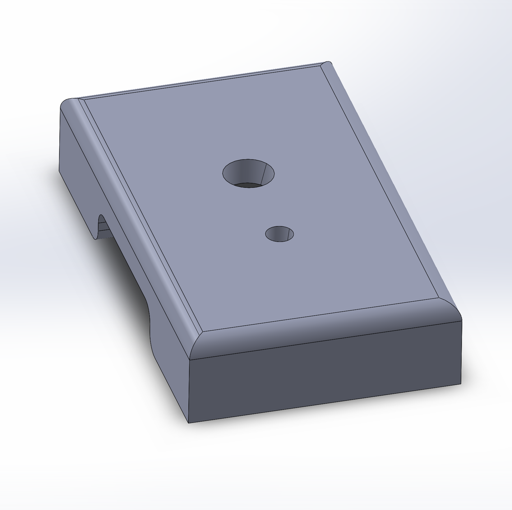
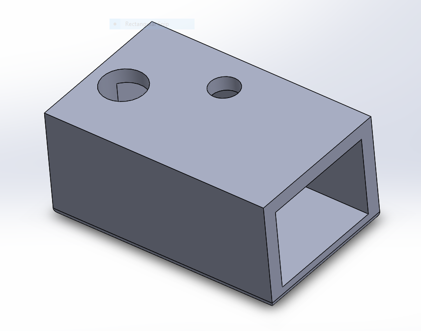

# Solidworks

We 3D-printed, and installed hardware on our laundry machines.

### Instructions
1. Use Solidworks 2018 to open your desired part that is stored in the `Parts/` folder.

2. Save the part as `.STL`.

3. Use Cura or any other 3D-printer software to create `.gcode` file.

4. Print with corresponding 3D printer.

### Our Results
#### Button and LED

We made our first prototype using a button and an led. For reasons yet unknown, the micropython ESP module was unstable, and it somehow received signals from the buttons without anyone pressing them. Hence, the module kept sending false data to our firebase database, making the entire system very unstable, and unusable.

#### Light sensor

Our 2nd prototype implements a digital light sensor that would send on / off signals to the ESP module. As long as we correctly tuned the sensitivity of the sensors, they worked perfectly; so far, we have yet observe any system-disruptive fluctuations.
